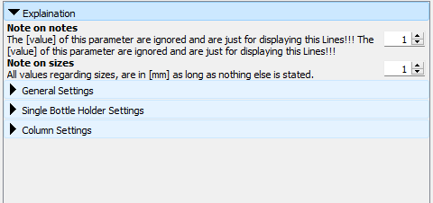
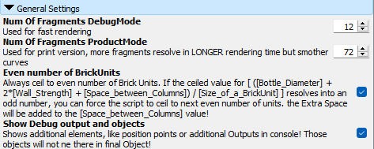
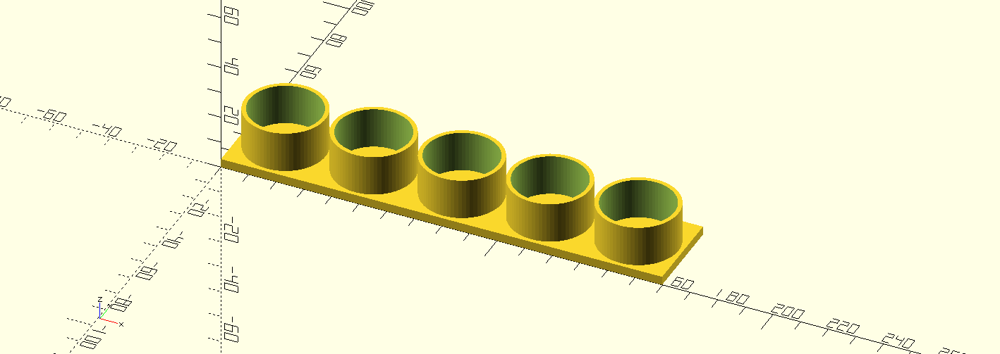
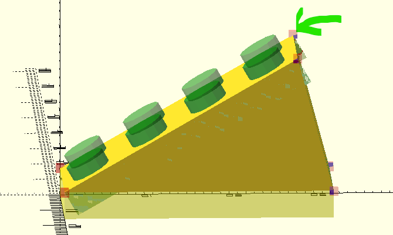
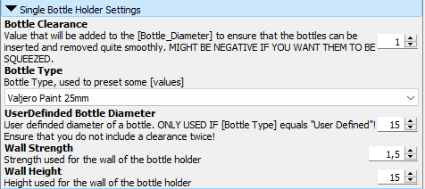
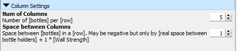

# BCCS - Brick compatible color shelf

## What is this project about?

This project allows the creation and printing of compatible holders for building blocks (like LEGO), making it easier to organize and store things like airbrush or tattoo colors. However, during the project, it actually split into two exciting sub-projects:

    The Bottle Holder
    The Angle Brick

## How did this project come about?

My wife, a passionate tattoo artist, asked if I could print her a tiered shelf for her tattoo colors. After discussing the idea, we identified three key requirements that most existing solutions didn’t quite meet:

    Scalability:S
    The collection of colors keeps growing. It would be great if the shelf could expand easily without having to print everything from scratch.

    Adjustable sizes & modularity:
    Different manufacturers have different bottle sizes. A flexible system that can handle various sizes would be ideal. Additionally, when you have more bottles of a particular size, it would be great to use the space more efficiently. This is where a modular system comes in handy.

    Quick to print:
    Let's be honest—many existing solutions take forever to print due to the time needed for the shelf or the underlying structure. But why not use something we already have lying around in abundance, or can get cheaply from third-party suppliers? In this solution, only the actual holders are printed, while the rest is built with building blocks.

## What about the angle bricks?

We’ve all been there: after printing the first few parts, you think, “Hey, this would be even cooler if...”. In this case, the idea was to have angled shelves. Instead of printing new shelves with slanted bases (which I actually tested once), I thought, why not use the formulas I already had for the base calculations to print a brick that serves as an adapter? And voilà, the angle brick was born!

## How to use
### Pre requirements / Used Software
If you want to create a holder based on your own requirements, you'll need the software:
- OpenSCAD (https://openscad.org)

### Definitions
| Term | Explanation |
|---|---|
|`[BrickUnit]`| Size of a single step that can be used for the   `[Width]` or `[Depth]` of a brick. |
| `[BrickLayer]`, `[Layer]`| Size of a single step that can be used for the   `[Height]` dimension of a brick.  (3-layers equal a "normal" brick height )|

### General
All changes should be made within the `Customizer` from OpenSCAD.
Both projects have a `General Settings - Section` with the following parameters.
Whenever something is related to size units. Those are in millimeter [mm] if nothing else is mentioned.

#### Customizer - General Settings - Section

##### Num Of Fragments
As Preview rendering is done in no time at all, it is not that accurate. Therefor any Round surface will be rendered with a limited amount of Fragments. Increasing one of that parameters, will lead to a smoother surface.

###### Example for preview

###### Example for rendered version

##### Even number of BrickUnits
To ensure the compatibility to the leading brick systems, the script will always ceil towards whole `[brickUnits]`.

If this option is ticked, it will not just ceil to the next whole `[brickUnit]`, but also to the next __EVEN__ `[brickUnit]`. This can for example be useful to match sizes of baseplates.

##### Show Debug outputs and object
If this option is ticked, additional information are echoed towards console or additional objects might appear on preview. This will be removed while rendering for stl - Export.

### Color Holder
#### Customizer - Bottle Settings - Section

##### Clearance
The `[value]` of this parameter will be added to `[bottle diameter]`. To ensure that bottles can be slide in and out easily. 

##### Bottle Type / UserDefined Bottle Diameter
A set of predefined `[bottle diameters]` that are needed frequently.
If the value `User Defined` is selected, the `[UserDefined_Bottle_Diameter]` - value will be used.

##### Wall
The parameters `[Strength]` and `[Height]` define exactly what they are named. 
How thick / high the Wall of the bottleHolder will be.

#### Customizer - Column Settings - Section

##### Num of Columns
Exactly what it sounds like

##### Space Between Columns
This value is more or less the `[min space between holders]`.
After calculating the needed `[brickUnits]` for the holder, the script will spread the holders even over the available space. But sometimes it can save one or two `[brickUnits]` if holder walls, that would normally be touching, would be merged. this can be done by setting this value to a negative value.

__NOTE / TO DO:__ this value must not be set to a value lower than `-[WallStrength]`! 
It is planed to implement a check on that in future versions!

## Known Issues
### Bricks are very tight
Reason for that is that i used real dimensions but only have a 0.4 Nozzle. Most likely i will add a little more clearance.
After placing it on a brick with a reasonable amount of force on a "`non printed one`" it will snap in on others as expected
